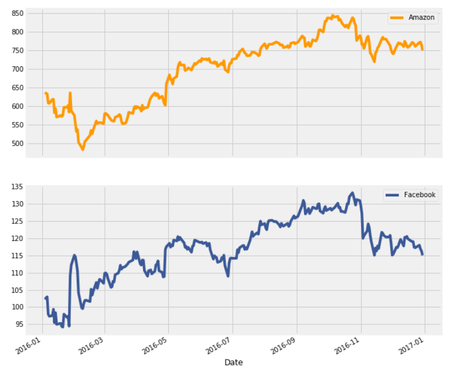

# Applied_Finance
Duong Vu

Sep, 2018

1st project: [The Sharpe Ratio](The_Sharpe_Ratio/notebook.ipynb)

Exploring the Stock Returns of two big tech company: Amazon and Facebook and compare them with the benchmark: S&P 500 Index.

